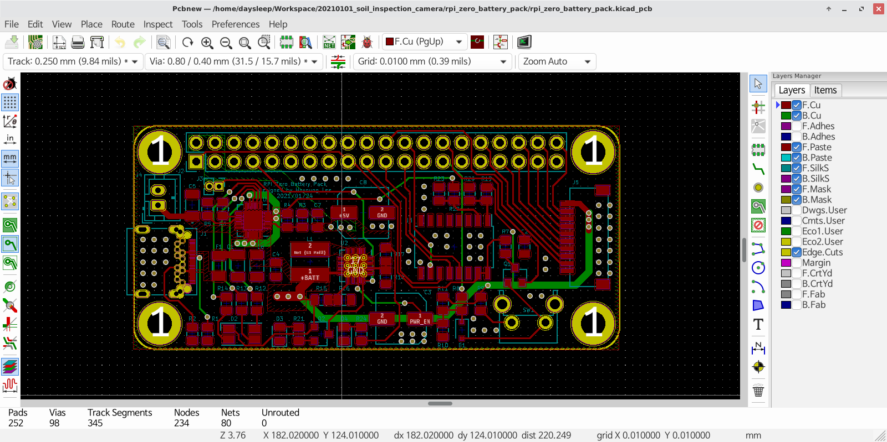
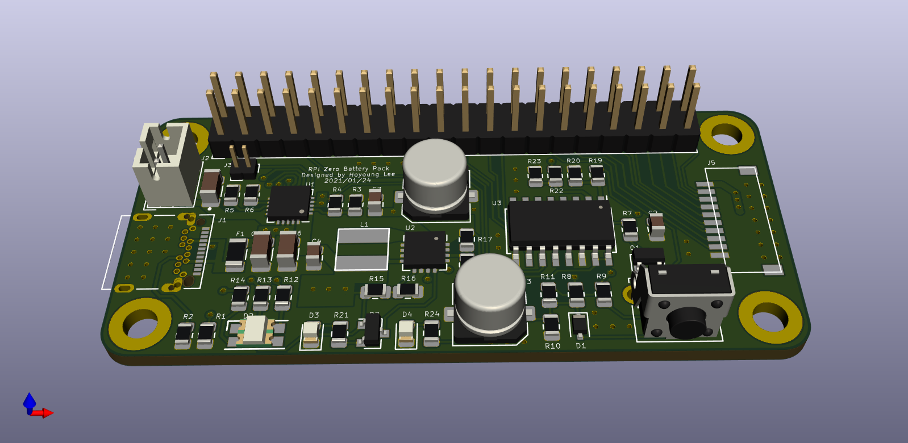

# rpi_zero_battery_pack
Battery, and power management platform for Raspberry Pi (zero) inspired by LiPoPi.
Please refer https://github.com/NeonHorizon/lipopi
This includes KiCad files with schematic, PCB, and 3D View.

# circuit
```{r image-ref-for-in-text, echo = FALSE, message=FALSE, fig.align='center', fig.cap='Schematic', out.width='0.75\\linewidth', fig.pos='H'}
knitr::include_graphics("./rpi_zero_battery_pack.sch.pdf")
```
# pcb


# 3d view

